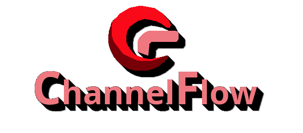

<h1 align="center">ChannelFlow TV</h1>
<h3 align="center">Android TV client for <a href="https://github.com/binarygeek119/ChannelFlow">ChannelFlow</a></h3>

---

<p align="center">

<br/><br/>
<a href="LICENSE">

</a>
<a href="https://github.com/binarygeek119/ChannelFlow-Client/releases">

</a>
<br/>
<a href="https://github.com/binarygeek119/ChannelFlow-Client/releases">Download the latest APK</a>
<br/><br/>
<strong>Downloader code: <code>3745820</code></strong>
</p>

ChannelFlow TV is a Leanback Android TV app for watching live IPTV from a [ChannelFlow](https://github.com/binarygeek119/ChannelFlow) server. It opens to the live guide, plays M3U streams, and pairs with a server using a quick pin. There is no Jellyfin login and no DVR.

It is a fork of [Jellyfin for Android TV](https://github.com/jellyfin/jellyfin-androidtv), cut down to live TV and the guide.

Author: [binarygeek119](https://github.com/binarygeek119)

## Install

On Fire TV or Android TV, install [Downloader](https://www.aftvnews.com/downloader/) from the Amazon Appstore (or Play Store), open it, and enter:

```
3745820
```

That code fetches the ChannelFlow TV APK. After it downloads, install it and allow unknown sources if the TV asks.

You can also download `ChannelFlow-TV-v*-release.apk` from [GitHub Releases](https://github.com/binarygeek119/ChannelFlow-Client/releases).

## Features

- Live TV guide loaded from the ChannelFlow M3U playlist and XMLTV listings
- Direct playback of live MPEG-TS streams
- Quick pin pairing (no server URL to type on the TV)
- Multiple saved servers, with switch / add / remove in settings
- Channel up/down by number, including decimals such as `119.1`
- Program details for listings that are not on now
- Reminders for upcoming programs, with a watch-now prompt when they start
- In-app updates from GitHub Releases

## Pairing

1. Install ChannelFlow TV with Downloader code `3745820`, or sideload the release APK.
2. On the TV, open the app and note the pin shown on screen.
3. In ChannelFlow, open **Quick Pin** and enter that code.
4. The TV saves the server and opens the guide.

The pin relay is `https://channelflow.duckdns.org` and is not user-configurable. Pins last 10 minutes.

## Building

The app uses Gradle and needs the Android SDK. Android Studio includes the required tooling. For a command-line debug build, use JDK 21 and the Gradle wrapper:

```shell
./gradlew assembleDebug
```

The debug APK is written to `app/build/outputs/apk/debug/` as `ChannelFlow-TV-v<version>-debug.apk`. Debug builds use a `.debug` application id, so they can sit next to a release install.

A local release APK (minified, signed with the debug key unless a keystore is configured):

```shell
CHANNELFLOW_VERSION=0.0.3 ./gradlew assembleRelease
```

The release APK is written to `app/build/outputs/apk/release/` as `ChannelFlow-TV-v0.0.3-release.apk`.

## Releases

Pushing a `v*` tag (or running **App / Release APK** from GitHub Actions) builds the release APK and attaches `ChannelFlow-TV-vX.Y.Z-release.apk` to the GitHub Release. The app checks that release on startup and from **Settings → About**, and can download and install it as an update.

```shell
git tag v0.0.3
git push origin v0.0.3
```

Optional repository secrets for a production signing key: `KEYSTORE` (base64 of the `.jks` file), `KEYSTORE_PASSWORD`, `KEY_ALIAS`, `KEY_PASSWORD`. Without them, CI signs the APK with the debug key.

Sideload the **release** APK once so later GitHub updates can install over it. Debug and release installs do not update each other.

## License

ChannelFlow TV is licensed under the [GNU General Public License v2.0](LICENSE), the same license as Jellyfin for Android TV, which this project is based on.
